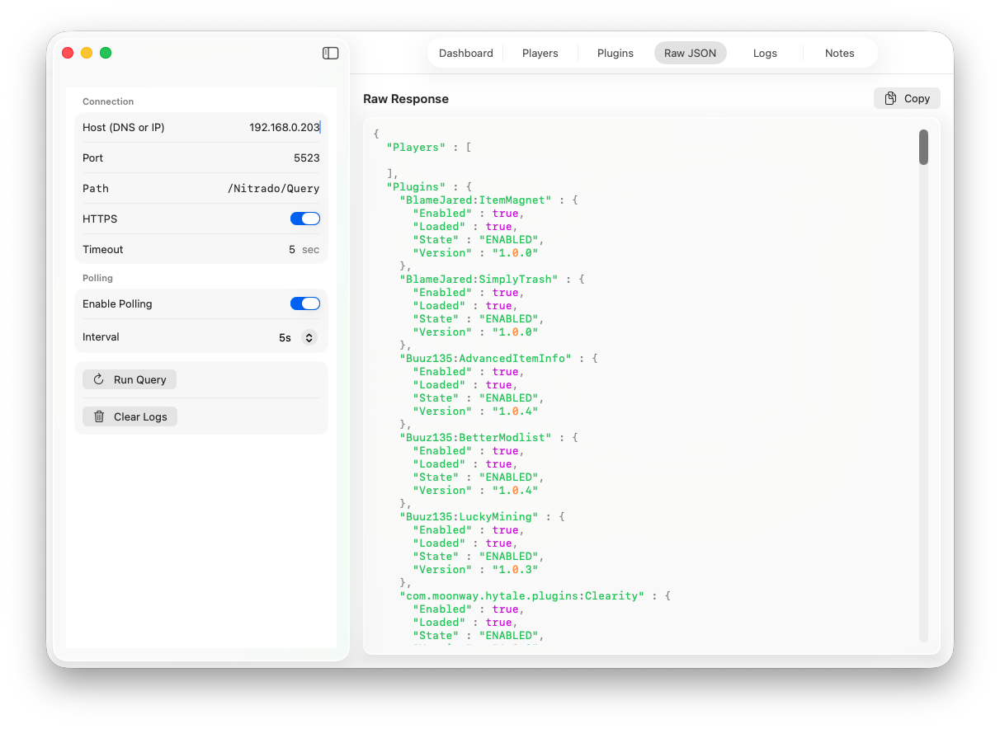
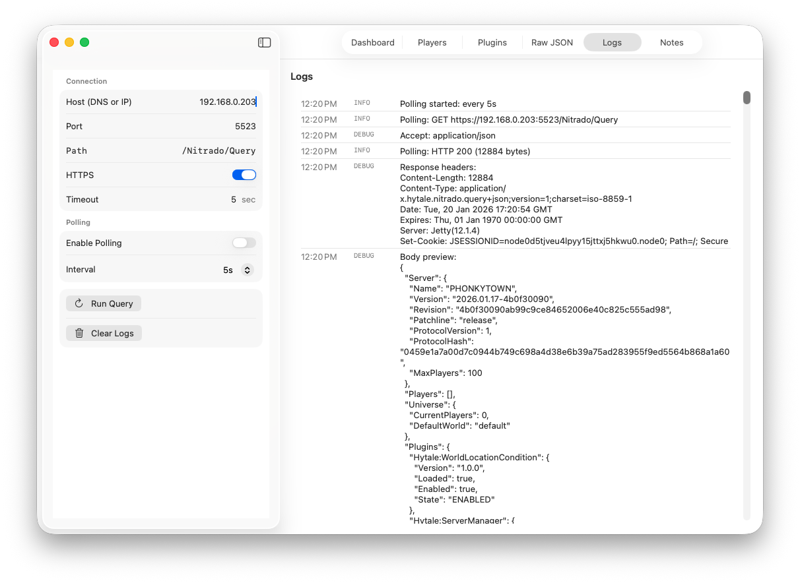
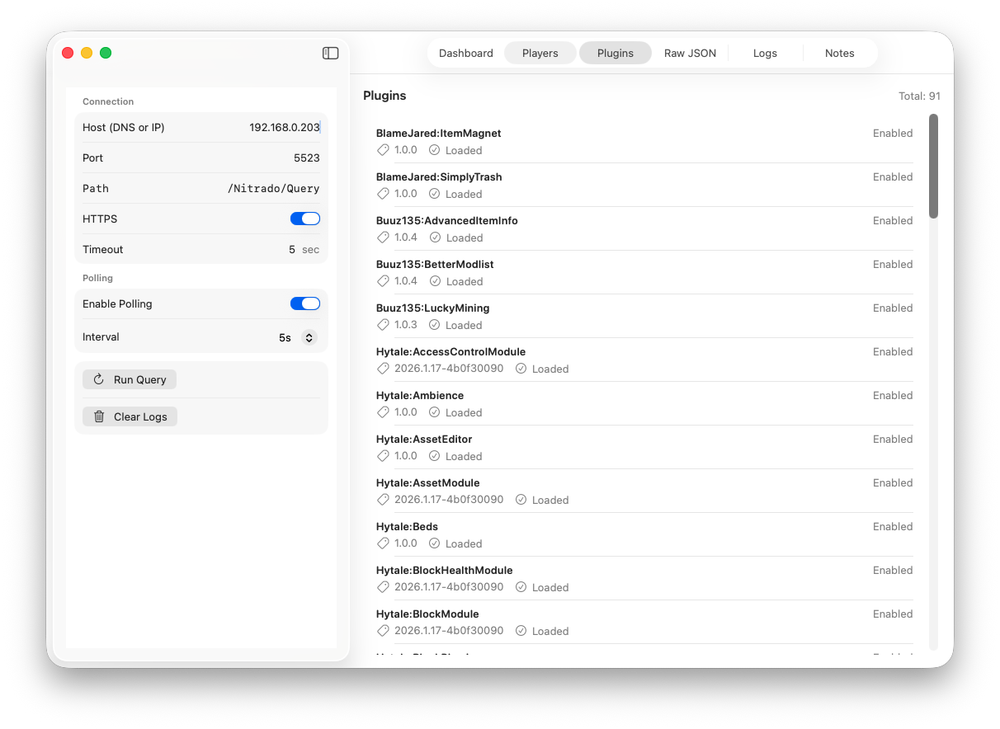

# Hyquery — Hytale LAN Monitor (macOS)

This is an unofficial fan project and is not affiliated with Hytale or Hypixel Studios.

A lightweight macOS SwiftUI app for monitoring a Hytale server on your local network. Hyquery polls the Nitrado WebServer Query endpoint and presents server, universe, player, and plugin information in a clean dashboard with logs and raw JSON inspection.

<p align="center">
  <a href="Hyquery/docs/main.png"></a>
</p>

<p align="center">
  
  
  
  
</p>

---

## Overview

Hyquery targets a Hytale server running on your LAN (for example, in Docker on host `NUCTAX` / `192.168.0.203`). It queries the WebServer plugin’s Query endpoint at `/Nitrado/Query` over HTTPS and:

- Shows high-level status: endpoint, polling state, and key server/universe stats
- Lists players and plugins when permissions allow
- Displays the raw JSON response with syntax highlighting
- Captures request/response logs for troubleshooting

This is ideal for local monitoring and debugging of your Hytale server without signing into the web console.

## Features

- SwiftUI macOS interface with a multi-tab layout: Dashboard, Players, Plugins, Raw JSON, Logs, and Notes
- One-shot requests and optional polling loop with configurable interval (1s–60s) that avoids overlapping requests
- Robust JSON parsing for flexible response shapes (arrays, wrapped arrays, dictionaries)
- Automatic handling of ISO-8859-1 responses by converting to UTF-8 for decoding
- URLSession-based client with required `Accept: application/json` header to avoid HTTP 406 responses
- Self-signed TLS support for known LAN hosts via `URLSessionDelegate`
- Copy-to-clipboard for raw JSON and project notes

## Screenshots

Below are compact thumbnails; click any image to view the full-size screenshot.

<p align="center">
  <a href="Hyquery/docs/main.png"></a>
  <a href="Hyquery/docs/json.png"></a>
  <a href="Hyquery/docs/logs.png"></a>
  <a href="Hyquery/docs/plugins.png"></a>
</p>

## Architecture

- SwiftUI-first with an `AppViewModel` (`@MainActor`, `ObservableObject`) providing state and actions
- Networking via `HytaleQueryClient` using `URLSession` (ephemeral configuration)
- Strongly-typed models (`QueryResponse`, `ServerInfo`, `UniverseInfo`, `PlayersInfo`, `PluginsInfo`) using `Codable`
- Defensive decoding for optional sections gated by server permissions
- Small, composable SwiftUI views for status cards, lists, and syntax-highlighted JSON

```text
Hyquery/
├─ ContentView.swift           # UI, tabs, and project notes
├─ HyqueryApp.swift            # App entry point
└─ (additional files as needed)


